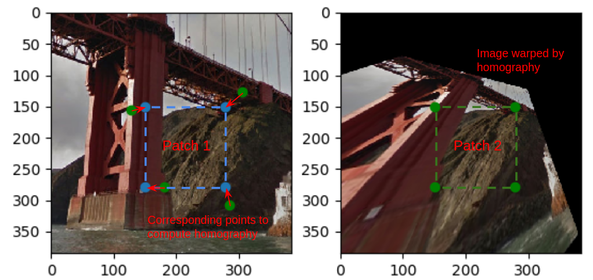
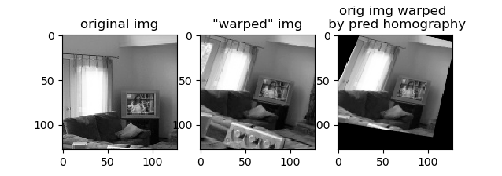
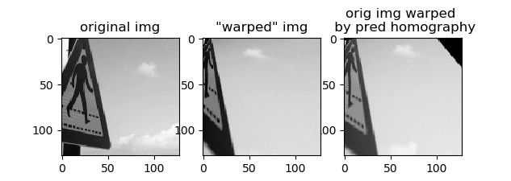
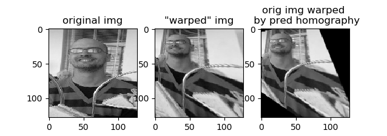
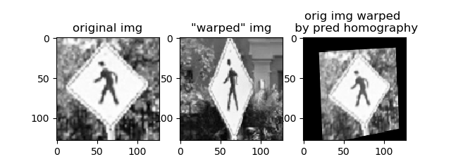
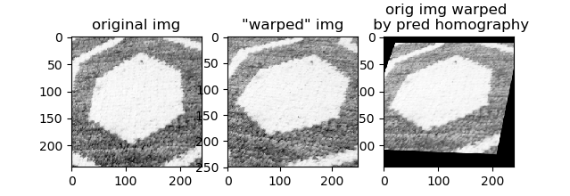

### Deep Homography

A homography dataset can be constructed by taking a patch from an image and perturbing the corners. The 4 point correspondences between the original patch and the perturbed ones define a homography. A neural network can learn to produce the parameterized homography given the patches from the warped and unwarped image. 

This repo reproduces the work of [DeTone et al. 2016](https://arxiv.org/pdf/1606.03798.pdf).

#### Making the data

Download the unlabeled [MS-COCO](http://cocodataset.org/#home) dataset and unzip such that the ~330k jpeg images are in `data/unlabeled2017`.

Install the data generation code that uses OpenCV:

```
cd data
mkdir build
cmake ..
make
```

Then run the data generation program:

```
cd build
./make_homography_data ../unlabeled2017 <int_patch_size> <int_max_jitter> <n_samples>
```

Use a patch size of 128, a max jitter of 32, and 500,000 samples to reproduce my results.

To train the network (saves each epoch):

```
python main.py
```

To see the performance on, e.g., the 4th image:

```
python eval.py --i 3
```

#### Background

A homography defines a transformation between two planes, including:
- An image plane and a planar object.
- Two different views of a planar object (or a very distant scene).
- Two images taken by a rotating camera.

Homographies are used in panorama stitching, camera calibration, and estimation of the camera pose.

As a 2D perspective transform in homogeneous coordinates, a homography can be represented as a 3x3 matrix, with 8 degrees of freedom. Estimating the homography requires 4 matching points in each image. If exact correspondences are not known, more points are provided and a technique like RANSAC is used. 

The authors of this paper do not learn the 8 parameters of the homography matrix directly, as it is notorously difficult to learn a target consisting of rotational and translational terms. The target is instead the x and y perturbations (in pixels) to the 4 corners of the patch extracted in estimating the homography.



The main contribution from the authors is a means to generate an endless supply of homography data. MS-COCO images are resized to 320x240, converted to grayscale, then a 128 pixel patch is extracted. The x and y coordinates of each patch corner are perturbed by a random amount between -32 and 32. With the 4 corresponding corners, the transform from the perturbed corners to the original can be estimated. The transform is applied to the image and then a 128x128 patch, at the same location as the original image, is extracted. The result is a pair of images that can be stacked in the channel dimension and a set 8 values, which define a homography. This serves as the input and target data for a neural network.

#### Notes

- The authors took the inverse of the homography between the original and perturbed corners, when they could have just estimated the homography between the perturbed and original.
- This dataset is created to simulate two different views of the same object. It would not work for homographies defining rotational views, as in panorama stitching, since there would be very little overlap in the patches.
- The authors did not mention scaling the corner perturbations, but I found dividing by 32 and putting a tanh layer on the output of the network was necessary for training.

#### Results

I implemented the regression form of their network, and followed the dataset prep, architecture, and training parameters specified in the paper.   

The network is very accurate on the synthetic data. Below are the original and warped patch, which are fed to the network as a 128x128x2 image. The predicted homography for this pair is applied to the original image to produce the image in the third column. 

The image warped by the predicted homography is very similar to the image warped by the true homography.





#### Transfer to real data

The problem with the data generation is that it treats every object in the image as being coplanar. This produces some unnatural images:



This makes me doubt that this network will work for any real data, outside of very special circumstances. For example, running the network on two views of a crosswalk sign from Google Maps yields:



The network is unsuccessful for this image pair consisting of objects on multiple planes. While there are plenty of signs in the training dataset, the background does not undergo the same transformation between the two images as the sign.

The network does better for a pair of images on the same plane, such as these two images of my rug: 



